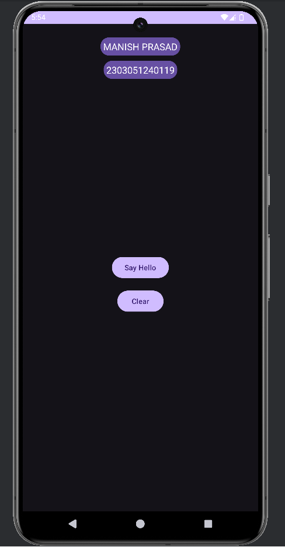

# My First Android App

Welcome to my first Android app, created using Java in Android Studio! This simple app has a basic interface with two buttons:
- A **Hello Button** that, when clicked, displays "Hello" on the screen.
- A **Clear Button** that clears the "Hello" message from the screen.

---

## Project Overview

This app was developed as an introduction to Android app development. It demonstrates basic concepts like:
- Creating buttons in the UI
- Handling button click events
- Modifying the display text based on user actions

---

## Features

- **Hello Button**: Displays the text "Hello" on the screen.
- **Clear Button**: Removes the "Hello" text from the screen.

---

## Repository Contents

This repository contains the following files:

1. **Interface.png**: A screenshot of the app’s interface.
2. **Java.docx**: The Java source code for the app's main functionality.
3. **working.mp4**: A screen recording that demonstrates the app in action.
4. **xml.docx**: The XML layout file defining the app’s user interface structure.

---

## How to Run the App

1. Clone this repository to your local machine.
2. Open the project in **Android Studio**.
3. Import the Java and XML code provided in the respective `.docx` files.
4. Build and run the app on an Android device or emulator.

---

## Screenshots

---

## Demo Video

Here’s a [link to the video demonstration](Working.mp4) to see the app in action.

You can view the working of the app in the **Working.mp4** file to see a quick demonstration.

---

## Future Improvements

As this is my first app, I am excited to learn and implement more advanced features in future projects!

---

## Feedback

Feel free to explore the code and provide feedback or suggestions for improvement!

---

Thank you for checking out my project!
